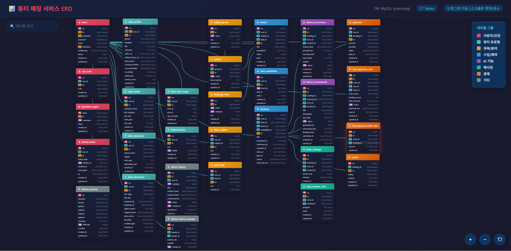

# 프로젝트 : 튜터링고 (Tutoring-Go)

<p align="center">
  
</p>

> 튜터와 튜티를 연결하고, 예약과 결제까지 관리할 수 있는 매칭 플랫폼

<br>

## 시연 영상

> 이미지를 클릭하면 시연 영상으로 이동합니다.
[](https://www.youtube.com/watch?v=ttQkyqMMFas)

<br>

---

## 목차
- [1. 프로젝트 개요](#1-프로젝트-개요)
- [2. 시스템 구조](#2-시스템-구조)
- [3. 팀 구성 및 역할](#3-팀-구성-및-역할)
- [4. 기술 스택](#4-기술-스택)
- [5. 프로젝트 수행 경과](#5-프로젝트-수행-경과)
- [6. 화면 UI](#6-화면-ui)
- [7. 자체 평가 의견](#7-자체-평가-의견)

---

<br>

## 1. 프로젝트 개요

### 1-1. 프로젝트 주제
- 튜터와 튜티를 연결하고, 수업 예약 및 결제까지 관리할 수 있는 매칭 플랫폼

### 1-2. 주제 선정 배경
- K-pop, K-drama 등 한류 확산으로 한국어 학습 수요가 지속적으로 증가
- 기존 튜터링 서비스는 튜터 탐색, 예약, 결제 과정이 분산되어 사용자 경험이 불편함
- 높은 수수료와 획일적인 커리큘럼으로 인해 튜터와 학습자 모두에게 제약 발생

### 1-3. 기획 의도
- 튜터 탐색부터 예약, 결제까지 하나의 플랫폼에서 통합 관리
- 학습 목적과 조건에 맞는 튜터를 선택할 수 있는 맞춤형 매칭 시스템 제공
- 예약과 결제 흐름을 연결하여 사용자 중심의 학습 환경 구축

### 1-4. 활용 방안
- 학습자는 원하는 조건의 튜터를 검색하고 수업을 예약 및 결제할 수 있음
- 튜터는 자신의 수업 정보를 등록하고 예약 및 일정 관리를 수행할 수 있음
- 플랫폼을 통해 수업 진행, 결제, 리뷰까지 일관된 흐름으로 관리 가능

### 1-5. 기대효과
- 예약 및 결제 통합을 통한 사용자 편의성 향상
- 맞춤형 튜터 매칭을 통한 학습 효율 증가
- 튜터와 학습자 간 효율적인 연결 구조 형성
- 다양한 학습 목적을 반영한 유연한 교육 환경 제공

<br>

---

## 2. 시스템 구조

### 2-1 Architecture
```text
teamproject/
├── SQL/                           ← 데이터베이스 스키마 및 초기 데이터 스크립트
├── docs/                          ← 요구사항 정의서, 기능 정의서, ERD 등 프로젝트 산출물
├── gradle/                        ← Gradle Wrapper
├── src/main/
│   ├── java/com/aloha/teamproject/
│   │   ├── api/                   ← 외부 API 연동
│   │   ├── common/                ← 공통 모듈
│   │   ├── config/                ← 애플리케이션 설정
│   │   ├── controller/            ← 요청 처리 계층
│   │   ├── dto/                   ← 데이터 전달 객체
│   │   ├── mapper/                ← MyBatis Mapper
│   │   ├── model/                 ← 도메인 모델
│   │   ├── security/              ← JWT / OAuth2 / Spring Security
│   │   ├── service/               ← 비즈니스 로직
│   │   ├── util/                  ← 유틸리티
│   │   ├── ServletInitializer.java
│   │   └── TeamprojectApplication.java
│   └── resources/                 ← application 설정, mapper XML, 기타 리소스
├── build.gradle
├── settings.gradle
├── gradlew
└── gradlew.bat
```

### 2-2. 주요 기능

| 구분 | 기능 |
|------|------|
| 인증 | 회원가입, 로그인/로그아웃, JWT 인증, Refresh Token |
| 회원 | 프로필 관리, 마이페이지 |
| 튜터 | 튜터 등록, 프로필 관리, 검색/조회, 스케줄 관리 |
| 예약 | 수업 예약, 예약 승인/거절, 취소, 시간 충돌 방지 |
| 결제 | 결제 처리, 결제 상태 관리, 결제 내역 조회 |
| 리뷰 | 리뷰 작성/조회/수정/삭제, 평점 관리 |
| 메시지 | 튜터-학생 간 메시지 기능 |
| 관리자 | 튜터 승인, 회원 관리, 과목 관리 |
| AI | OpenAI 기반 보조 기능 |

---

<br>

## 3. 팀 구성 및 역할

| 이름 | 역할 | 담당 업무 |
|:------:|:---:|:---|
| **정성준** | Backend | JWT 기반 인증 필터 및 SecurityContext 처리 구현, 튜터 마이페이지 및 예약 API 개발, 서버 측 예약 충돌 검증 로직 설계, Toss 결제 승인 처리 및 OpenAI API 연동 기능 구현, MyBatis 기반 DB 설계 및 매퍼 작성 |
| **이효미** | Backend / Front Support | 사용자·튜터 API 개발, DB 매퍼 및 DTO 작성, 회원가입 및 튜터 등록 기능 구현, 인증·보안 처리 보조, 예외/응답 표준화, 파일 업로드 흐름 및 FileService 구현 |
| **김경화** | Frontend / Planning | 전반적인 웹페이지 프론트 구현, Figma 기반 UI 설계 및 디자인, 요구사항 정의서 및 기능 정의서 작성, 기능 테스트 및 QA |
| **조성진** | Frontend / UI·UX / Presentation | 프론트엔드 개발 및 UI/UX 디자인 총괄, 디자인 시스템 구축, 템플릿 구조화, 회원·인증·결제 UI 구현, 발표 및 시연 담당 |

> 인원 : **4명** &nbsp;|&nbsp; 기간 : **약 3주**

---

<br>

## 4. 기술 스택

### Frontend
<div align="left">
  
  
  
  
</div>

### Backend
<div align="left">
  
  
  
  
</div>

### Database
<div align="left">
  
</div>

### API / Service
<div align="left">
  
  
  
  
</div>

### Tools
<div align="left">
  
  
</div>

---

## 5. 프로젝트 수행 경과

### 요구사항 정의서
<details>
  <summary>요구사항 정의서 보기</summary>

  <p align="center">
    
  </p>
</details>

### 기능 정의서
<details>
  <summary>기능 정의서 보기</summary>
  
  <p align="center">
    
  </p>
</details>

### ERD
<details>
  <summary>ERD 보기</summary>
  <p align="center">
    
  </p>

  > 전체 ERD는 인터랙티브 화면으로 확인할 수 있습니다.  
  > [ERD 상세 보기 (Interactive)](https://numpad73192846.github.io/MSA15_Project/docs/erd/MSA15기_1조_튜터링고ERD.html)
</details>

### 간트 차트
<details>
  <summary>간트 차트 펼치기</summary>
  
 > 약 3주간의 개발 일정을 단계별로 정리했습니다.

```mermaid
gantt
    title 튜터링고 프로젝트 일정
    dateFormat YYYY-MM-DD
    axisFormat %m/%d
    excludes weekends

    section 초기 설정
    회원가입 UI    :a1, 2026-01-27, 2d
    권한 설정      :a2, 2026-01-27, 2d

    section 마이페이지
    마이페이지 UI  :b1, 2026-01-29, 2d
    페이지 연동    :b2, 2026-01-29, 2d
    Thymeleaf      :b3, 2026-01-30, 2d

    section 백엔드
    DTO/Mapper     :c1, 2026-01-30, 2d
    파일 업로드    :c2, 2026-01-31, 2d
    메인 구성      :c3, 2026-02-02, 2d

    section 예약/결제
    캘린더 프론트  :d1, 2026-02-04, 2d
    예약 API       :d2, 2026-02-04, 2d
    DB 연동        :d3, 2026-02-05, 2d
    결제 1차       :d4, 2026-02-05, 2d

    section 기능 개선
    투두 개선      :e1, 2026-02-06, 2d
    비디오 수정    :e2, 2026-02-07, 2d
    UI 개선        :e3, 2026-02-08, 2d

    section 마무리
    계정 페이지    :f1, 2026-02-09, 2d
    소셜 로그인    :f2, 2026-02-10, 2d
    관리자 기능    :f3, 2026-02-11, 2d
    메인 수정      :f4, 2026-02-12, 2d
    AI 기능        :f5, 2026-02-12, 2d
  ```

</details>

---

## 6. 화면 UI

### 1. 회원가입 / 로그인

<details>
  <summary>보기</summary>
  
  <h4>로그인</h4>
  

  <h4>학생 회원가입</h4>
  

  <h4>튜터 회원가입1</h4>
  

  <h4>튜터 회원가입2</h4>
  

  <h4>튜터 회원가입3</h4>
  

  <h4>튜터 회원가입4</h4>
  

  <h4>튜터 회원가입5</h4>
  

</details>

### 2. 메인 화면

<details>
  <summary>보기</summary>

  

</details>

### 3. 튜터 검색 / 목록

<details>
  <summary>보기</summary>

  
  

</details>

### 4. 튜터 상세

<details>
  <summary>보기</summary>

  

</details>

### 5. 예약

<details>
  <summary>보기</summary>

  
  

</details>

### 6. 결제

<details>
  <summary>보기</summary>

  

</details>

### 7. 마이페이지

<details>
  <summary>보기</summary>

  

</details>

### 8. 리뷰

<details>
  <summary>보기</summary>

  

</details>

### 9. 관리자

<details>
  <summary>보기</summary>

  

</details>

---

## 7. 자체 평가 의견

### 잘한 점

- Spring Boot 기반 MVC 구조를 적용하여 Controller / Service / DAO 계층을 분리하고, 역할별 책임을 명확히 나누어 유지보수성을 확보함  
- JWT 인증 필터를 직접 구현하여 요청 단위 인증 흐름과 SecurityContext 기반 인증 처리 구조를 이해함  
- 예약 기능에서 시간 충돌 검증 로직을 서버에서 처리하여, 클라이언트 의존 없이 데이터 무결성을 보장하는 구조를 설계함  
- Toss Payments 연동을 통해 결제 완료 이후 예약 상태가 변경되는 흐름을 구현하며, 트랜잭션 처리의 중요성을 체감함  
- OAuth2 및 OpenAI API 등 외부 API를 연동하며 서비스 확장 구조를 경험함  

### 아쉬운 점

- 초기 기획 단계에서 예약, 결제, 인증 흐름을 충분히 정의하지 않아 개발 중간에 구조를 수정하는 과정이 발생함  
- 기능 단위로 개발을 진행하면서 전체 서비스 흐름(예약 → 결제 → 완료 → 리뷰)에 대한 설계가 뒤늦게 정리됨  
- 프론트엔드와의 협업 과정에서 API 명세 및 데이터 구조가 명확히 정의되지 않아 일부 기능 수정이 발생함  

### 개선할 점

- 서비스 흐름을 기준으로 기능을 설계하고, 개발 전에 전체 프로세스를 명확히 정의하는 방식으로 개선할 필요가 있음  
- JWT 인증 및 권한 처리, 결제 로직 등 보안과 관련된 부분을 더 체계적으로 설계할 필요가 있음  
- API 명세를 사전에 정의하고, 프론트엔드와의 협업 방식을 개선하여 개발 효율을 높일 필요가 있음  
